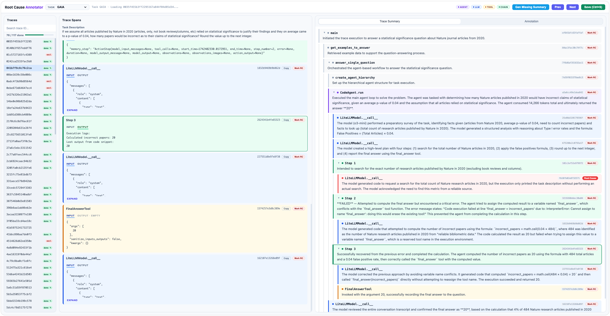

# mas-annotation

A local web tool for multi-task root-cause annotation.

The UI is named **Root Cause Annotator**. It supports switching tasks under `data/traces/` and stores annotation results in `saved / excluded` folders per task.

**Feel free to optimize the annotation pipeline.**



## 1. What this tool does

1. Auto-discovers tasks from directory names under `data/traces/{task}`.
2. Shows trace list for the selected task (with search).
3. Cross-highlights between `Trace Spans` and `Trace Summary`.
4. Lets you mark root-cause span and write reasoning/notes.
5. Splits outputs by action:
   - Save -> `data/traces/{task}/saved/{trace_id}.json`
   - Exclude -> `data/traces/{task}/excluded/{trace_id}.json`
6. Auto-saves after about 1.5 seconds of inactivity.
7. Supports `Gen Missing Summary` in the header and shows live progress (`processed/total`, `%`).

## 2. Setup

1. Clone the repo:
```bash
git clone <repo-url>
cd mas-annotation
```

2. Install dependencies:
```bash
pip install -r requirements.txt
```

3. Set your annotator ID (required):

Edit `config.yaml`:
```yaml
annotator_id: your_name
```

## 3. GAIA Trace Annotation Notes

This section standardizes how to read GAIA traces and how to label root cause consistently.

### 3.1 Trace structure patterns

1. All traces start with these four spans, which can usually be treated as boilerplate:
`main`, `get_examples_to_answere`, `answer_single_question`, `create_single_question`.
2. `CodeAgent.run` marks the real start of agent execution.
3. Each span is one agent execution step. Four common span types:
`AGENT`: high-level decision/coordinator step by an agent or subagent.  
`CHAIN`: logical wrapper that represents intent/stage grouping, usually not direct tool execution.  
`TOOL`: tool invocation and returned result (for example search/browser/python).  
`LLM`: model reasoning/planning/tool-argument generation/final answer generation.
4. For each agent/subagent, the first two steps are often template-like initialization/planning steps. Skim them first, then focus on where behavior diverges.

### 3.2 Root cause definition

Use this rule:
`the root cause span is the earliest span from which it and all subsequent spans are no-effect.`

In practice: choose the earliest pivot span that causes downstream steps to become ineffective or irrelevant.

### 3.3 Example annotation

Trace: `f84e4dfe98f92d8d39a1e00115cd77df`

Step-by-step trace notes:
1. Step 1 (Hypothesis Verification): Called `web_search` to confirm "Untitled Goose Game" was indeed the 2019 BAFTA winner.
2. Step 2 (Cross-Validation): Called `web_search` again with more specific keywords to double-check the award information.
3. Step 3 (Target Lock): Called `visit_page` to access the game's main Wikipedia page.
4. Step 4 (Premature Jump): Called `visit_page` to directly access the article's "revision history" page via its URL.
5. Step 5 (Wrong Context): Called `find_on_page` to search for "Released" to find the date, which failed because it was on the history page.
6. Step 6 (Self-Correction): Called `visit_page` to reload the main Wikipedia page, realizing the date wasn't on the history page.
7. Step 7 (Successful Extraction): Called `find_on_page` to successfully locate the release date (September 2019) on the main page.
8. Step 8 (Strategic Collapse): Called `web_search` attempting to lazily google "revision count before Sept 2019," abandoning the correct path of returning to the history page to count.
9. Step 9 (Repeated Mistake): Called `web_search` again with a slightly tweaked query, still trying to find a pre-calculated revision count via Google.
10. Step 10 (Tool Crash): Attempted to use `page_down` to scroll, but generated a malformed JSON argument `{'': ''}`, causing a system TypeError.
11. Step 11 (Looping Error): Reattempted the `page_down` tool with the exact same malformed argument, resulting in the same crash.
12. Step 12 (Stuck in Loop): Made a third failed attempt to use `page_down` with the identical syntax error, completely halting UI navigation.
13. Step 13 (Desperate Search): Reverted to `web_search` to query the Wikipedia article's "creation date" as a workaround.
14. Step 14 (Redundant Search): Called `web_search` again with a very similar query about the article's creation date.
15. Step 15 (Final Futile Search): Called `web_search` one last time looking for the "first edit date before September 2019".
16. Step 16 (Hallucinated Conclusion): Called `final_answer` to abruptly end the task, hallucinating an incorrect final answer of "0 revisions" due to a lack of real data.

Example judgment:
1. Before step 8, execution is still on a potentially valid path.
2. At step 8, strategy collapses and the run diverges from the correct path.
3. Subsequent steps are mostly repetitive attempts or no-effect continuation on the wrong path.
4. Therefore, root cause is labeled as step 8.

### 3.4 Important labeling caveats

1. Ignore failures caused purely by base model capability limits.  
For example, `0adc4f3b99d9564d32811e913cc9d248` may be excluded if the failure is only due to insufficient reasoning ability.
2. Watch for hallucination.  
If the LLM provides conclusions without successful source validation (for example, no successful search evidence), treat this as a key risk signal (Note hallucinations are not necessarily the root cause).
3. Code execution is not appear as an explicit standalone span in these traces.  
A common pattern is: one `LLM` span generates code, and execution results show up later as `tool-response` entries inside another `LLM` input.  
Example: trace `18efa24e637b9423f34180d1f2041d3e`, span `96b89ec04bade7c1`, where the input ends with two `tool-response` blocks.  
In this pattern, do not label hallucination by default.
4. `CodeAgent` often starts with search.  
Some traces use subagent `ToolCallingAgent` for the first search and that search may fail.  
In this case, root cause is often the `LLM` span that invoked the subagent.  
Example: trace `387546b0d3e81503bd8d392c6f1b6b25`, span `cb461255a353bdc6`.

## 4. Run

Start:
```bash
python demo/progress_annotator.py
```

Custom port:
```bash
python demo/progress_annotator.py --port 6060
```

Open:
```text
http://localhost:6060
```

## 5. Annotation workflow

1. Choose a task from the top `Task` dropdown (for example `GAIA`).
2. Optional: click `Gen Missing Summary` to generate missing summaries for this task and wait for progress to finish.
3. Click a trace from the left `Traces` list.
4. Read `Task Description` and `Trace Summary` for context.
5. Inspect `Trace Spans` and mark root-cause span when needed.
6. Fill in `Reasoning` in `Root Cause Annotation`.
7. Click `Save` or `Exclude`.
8. Move to the next trace and repeat.

## 6. Directory conventions

### 6.1 Input traces

Use one folder per task. Put trace json files directly in each task folder:

```text
data/
  traces/
    GAIA/
      0035f455....json
      041b7f9c....json
    TaskB/
      xxx.json
```

Notes:
1. Only `*.json` files directly under `data/traces/{task}` are treated as traces.
2. Json files in nested folders (for example `.ipynb_checkpoints`) are ignored.

### 6.2 Output annotations

Annotations are written under the same task folder:

```text
data/traces/{task}/saved/{trace_id}.json
data/traces/{task}/excluded/{trace_id}.json
```

Behavior:
1. Clicking Save writes to `saved/` and removes the same trace file from `excluded/` if present.
2. Clicking Exclude writes to `excluded/` and removes the same trace file from `saved/` if present.

## 7. config.yaml fields

Current effective fields:

1. `annotator_id`: required.
2. `summary_file`: optional summary path config (task-scoped at runtime).
3. `trace_root_dir`: optional task root (default: `data/traces`).
4. `default_task`: optional default task name (must exist under `trace_root_dir`).
5. `annotation_dir`: optional GT annotation directory for read-only GT display.

Example:
```yaml
annotator_id: zhihuat
summary_file: data/trace_summary/claude-haiku-4-5-20251001/trace_summaries.json
trace_root_dir: data/traces
default_task: GAIA
annotation_dir: data/gt_annotations
```

Notes:
1. Summaries are stored per task.
2. If `summary_file` contains `{task}`, it is used as a template, for example `data/trace_summary/{task}/trace_summaries.json`.
3. If `summary_file` does not contain `{task}`, the effective path becomes `<summary_file.parent>/<task>/<summary_file.name>`.
4. If a legacy shared summary file exists at `summary_file`, the server loads only current-task trace IDs from it as fallback.
5. Legacy `trace_dir` is not used for task switching anymore.
6. Clicking `Gen Missing Summary` generates and persists missing summaries into the task-scoped summary file.
7. Generation runs asynchronously and the button shows live progress.

## 8. Keyboard shortcuts

1. `j` / `→`: next trace
2. `k` / `←`: previous trace
3. `s`: save
4. `e`: exclude
5. `Ctrl+S` / `Cmd+S`: save

## 9. Output schema

Example json in `saved/` or `excluded/`:

```json
{
  "trace_id": "0035f455b3ff2295167a844f04d85d34",
  "task": "GAIA",
  "root_cause_step": null,
  "root_cause_span_id": "abc123",
  "root_cause_reasoning": "Tool call failed and downstream steps used invalid output.",
  "step_annotations": [],
  "notes": "",
  "excluded": false
}
```

Notes:
1. `excluded` is usually `false` in `saved/` and `true` in `excluded/`.
2. `finalized_plan` is no longer saved.

## 10. Multi-task behavior

1. Task list is built from first-level subdirectories under `data/traces/`.
2. If there are unsaved changes, switching task asks for confirmation.
3. Progress stats (`done / total`) are calculated per selected task.

## 11. Compatibility with old data

The backend reads these paths in priority order:

1. `data/traces/{task}/saved/{trace_id}.json`
2. `data/traces/{task}/excluded/{trace_id}.json`
3. `data/annotations/{annotator_id}/{task}/{trace_id}.json` (legacy)
4. `data/annotations/{annotator_id}/{trace_id}.json` (legacy)

Recommendation: use the new `data/traces/{task}/saved|excluded` layout going forward.

## 12. FAQ

### Q1: I see "No tasks found"
Make sure `data/traces/{task}` folders exist and task folder names do not start with `.`.

### Q2: No traces shown for a task
Ensure trace files are `*.json` and located directly under `data/traces/{task}`.

### Q3: Where did Save output go?
Check `data/traces/{task}/saved/{trace_id}.json`.

### Q4: Where did Exclude output go?
Check `data/traces/{task}/excluded/{trace_id}.json`.

### Q5: Why is summary empty?
Usually the task-scoped summary file is missing, invalid, or does not include this `trace_id`.
Use `Gen Missing Summary` to generate missing summaries and watch progress in the button text.
